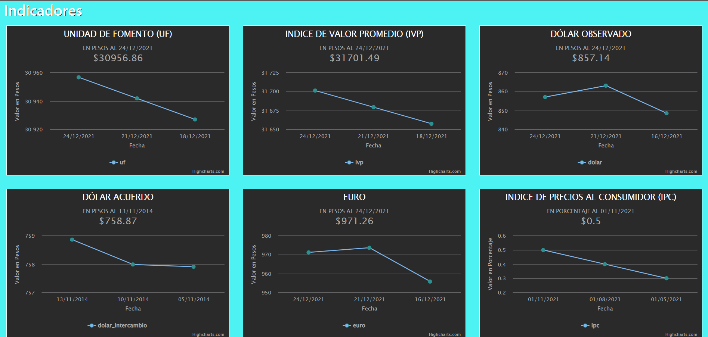
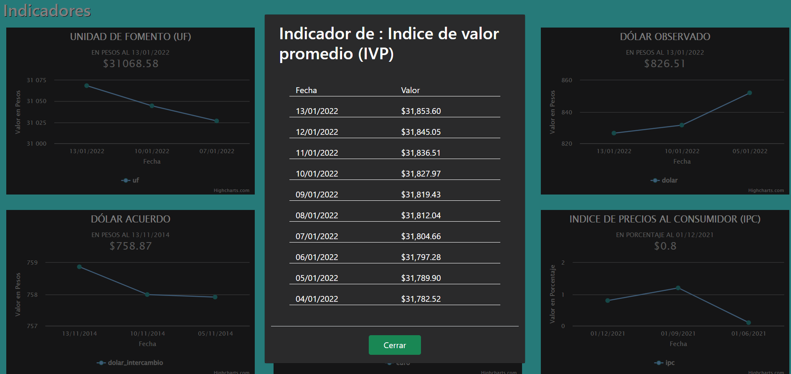

# README

Ejercicio desarrollado con Angular 12 y librería de gráficos Hightcharts.
Muestra el comportamiento de indicadores como UF, Dolar y Tasa de desempleo.

### Como usar la aplicacion?

- Clona el repositorio de github
- Abre tu IDE favorito y corre la app con el comando ng serve

### Asi se ve mi proyecto

##Que lo disfruten!!!
